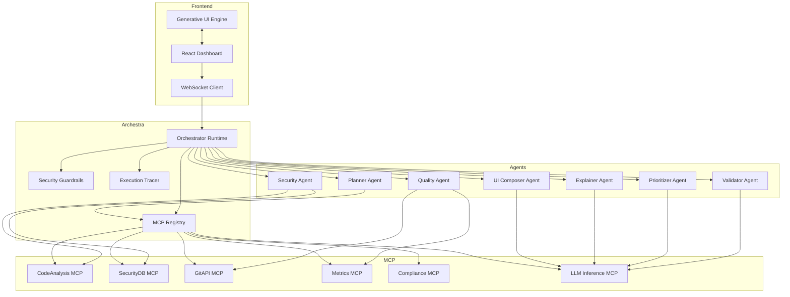

# CodeAudit: Technical Architecture

## System Architecture

### 1. Component Overview



### 2. Data Flow: Audit Execution

```
┌──────────────────────────────────────────────────────────────┐
│  Step 1: User Uploads Repository                            │
└───────────────────────┬──────────────────────────────────────┘
                        │
                        ▼
┌──────────────────────────────────────────────────────────────┐
│  Step 2: Orchestrator Creates Audit Session                 │
│  - Generates session ID                                      │
│  - Initializes agent pool                                    │
│  - Sets up WebSocket channel                                 │
└───────────────────────┬──────────────────────────────────────┘
                        │
                        ▼
┌──────────────────────────────────────────────────────────────┐
│  Step 3: Planner Agent Analyzes Scope                       │
│  - Scans repo structure via GitAPI MCP                       │
│  - Identifies file types, dependencies                       │
│  - Estimates audit duration                                  │
│  - Creates execution plan                                    │
│  - Emits: "plan_complete" event                              │
└───────────────────────┬──────────────────────────────────────┘
                        │
                        ▼
┌──────────────────────────────────────────────────────────────┐
│  Step 4: Parallel Agent Execution                           │
│  ┌────────────────────────────────────────────────────────┐ │
│  │  Security Agent          │  Quality Agent              │ │
│  │  - SAST scan             │  - Complexity analysis      │ │
│  │  - CVE check             │  - Coverage check           │ │
│  │  - Secret detection      │  - Performance metrics      │ │
│  │  Emits: findings[]       │  Emits: quality_issues[]    │ │
│  └────────────────────────────────────────────────────────┘ │
│  ┌────────────────────────────────────────────────────────┐ │
│  │  Compliance Agent        │  Validator Agent            │ │
│  │  - Maps to standards     │  - Cross-references         │ │
│  │  - Checks policies       │  - Filters false positives  │ │
│  │  Emits: compliance%      │  Emits: validated_findings[]│ │
│  └────────────────────────────────────────────────────────┘ │
└───────────────────────┬──────────────────────────────────────┘
                        │
                        ▼
┌──────────────────────────────────────────────────────────────┐
│  Step 5: Prioritizer Agent Ranks Issues                     │
│  - Receives all findings from agents                         │
│  - Applies risk scoring algorithm                            │
│  - Considers: severity, exploitability, business impact      │
│  - Sorts by priority                                         │
│  - Emits: "prioritization_complete"                          │
└───────────────────────┬──────────────────────────────────────┘
                        │
                        ▼
┌──────────────────────────────────────────────────────────────┐
│  Step 6: Explainer Agent Generates Remediation              │
│  - For top 10 critical findings                              │
│  - Uses LLM to generate explanations                         │
│  - Creates code examples                                     │
│  - Estimates fix effort                                      │
│  - Emits: "explanations_ready"                               │
└───────────────────────┬──────────────────────────────────────┘
                        │
                        ▼
┌──────────────────────────────────────────────────────────────┐
│  Step 7: UI Composer Agent Generates Dashboard              │
│  - Transforms findings into UI component specs               │
│  - Defines layout: heat maps, tables, cards                  │
│  - Creates action buttons (Apply Fix, Delegate, Dismiss)     │
│  - Generates follow-up recommendations                       │
│  - Emits: "ui_spec" JSON                                     │
└───────────────────────┬──────────────────────────────────────┘
                        │
                        ▼
┌──────────────────────────────────────────────────────────────┐
│  Step 8: Frontend Renders Generative UI                     │
│  - Receives ui_spec via WebSocket                            │
│  - React components dynamically render                       │
│  - User interacts with generated UI                          │
└──────────────────────────────────────────────────────────────┘
```

### 3. Agent Interaction Protocol

**Agent Communication Pattern:**

```typescript
// Event-driven coordination
type AgentEvent = {
  sessionId: string;
  timestamp: number;
  agentId: string;
  eventType: 'started' | 'progress' | 'completed' | 'error';
  data: any;
  dependencies?: string[]; // Which agents must complete first
};

// Example flow
1. Planner emits: { eventType: 'completed', data: { plan } }
2. Orchestrator receives, validates plan
3. Orchestrator spawns: Security, Quality, Compliance agents (parallel)
4. Each agent registers with SecurityGuardrails for tool access
5. Agents emit progress events (streamed to UI)
6. Validator waits for all 3 agents to complete (dependency)
7. Validator emits validated findings
8. Prioritizer processes (dependency on Validator)
9. Explainer runs (dependency on Prioritizer)
10. UI Composer runs last (dependency on Explainer)
```

### 4. MCP Tool Integration

**Registry Pattern:**

```typescript
// backend/orchestrator/registry.ts
class MCPRegistry {
  private tools: Map<string, MCPToolDefinition>;
  
  register(tool: MCPToolDefinition) {
    // Validates tool schema
    // Stores connection details
    // Sets up health checks
  }
  
  discover(capabilities: string[]): MCPToolDefinition[] {
    // Returns tools matching capabilities
    // Example: agent asks for "code_analysis" capability
  }
  
  invoke(toolId: string, params: any, context: SecurityContext) {
    // 1. Validate security context
    // 2. Apply rate limiting
    // 3. Execute tool via MCP protocol
    // 4. Log to tracer
    // 5. Return result
  }
}
```

**Tool Invocation Flow:**

```
Agent Request
     ↓
Security Check (guardrails)
     ↓
Rate Limit Check
     ↓
MCP Protocol Encoding
     ↓
Tool Server Execution
     ↓
Response Validation
     ↓
Trace Logging
     ↓
Agent Response
```

### 5. Security Architecture

**Guardrails Implementation:**

```typescript
// backend/orchestrator/security.ts
class SecurityGuardrails {
  // 1. Authentication & Authorization
  validateAgentAccess(agentId: string, toolId: string): boolean {
    // Example: Security Agent can access CVE DB
    //          UI Composer cannot access CVE DB
  }
  
  // 2. Rate Limiting (per session)
  checkRateLimit(sessionId: string, toolId: string): boolean {
    // Max 10 calls/min per tool per session
  }
  
  // 3. Input Sanitization
  sanitizeToolInput(params: any): any {
    // Prevent path traversal, injection attacks
    // Example: Ensure repo_path is within upload directory
  }
  
  // 4. Output Filtering
  filterSensitiveData(result: any): any {
    // Remove API keys, secrets from tool responses
    // Redact user PII if found in code
  }
  
  // 5. Timeout Enforcement
  enforceTimeout(toolRequest: Promise<any>, maxTime: number) {
    // Kill tool execution if exceeds threshold
  }
}
```

### 6. Observability Stack

**Tracing Schema:**

```typescript
// backend/orchestrator/tracing.ts
type TraceEntry = {
  traceId: string;           // Audit session ID
  spanId: string;            // Unique step ID
  parentSpanId?: string;     // Parent step (for nesting)
  timestamp: number;
  duration?: number;
  
  // What happened
  component: 'agent' | 'orchestrator' | 'mcp-tool';
  componentId: string;       // e.g., "security-agent"
  action: string;            // e.g., "invoke_sast_scan"
  
  // Context
  input: any;                // Sanitized request data
  output?: any;              // Sanitized response
  error?: string;
  
  // Metadata
  tags: Record<string, string>;  // {severity: 'critical', tool: 'sast'}
};

// Example trace
[
  { spanId: '1', component: 'orchestrator', action: 'start_audit' },
  { spanId: '2', parentSpanId: '1', component: 'agent', 
    componentId: 'planner', action: 'analyze_scope' },
  { spanId: '3', parentSpanId: '2', component: 'mcp-tool',
    componentId: 'git-api', action: 'scan_repo', duration: 150 },
  { spanId: '4', parentSpanId: '1', component: 'agent',
    componentId: 'security', action: 'sast_scan' },
  ...
]
```

**Visualization:**

```
Audit Timeline (sessionId: abc123)
├─ [0ms] Orchestrator: start_audit
│  ├─ [10ms] Planner Agent: analyze_scope
│  │  └─ [15ms] GitAPI MCP: scan_repo (150ms)
│  ├─ [200ms] Security Agent: sast_scan
│  │  ├─ [205ms] CodeAnalysis MCP: analyze (2.3s)
│  │  └─ [2.5s] SecurityDB MCP: check_cve (800ms)
│  ├─ [200ms] Quality Agent: metrics_check
│  │  └─ [210ms] Metrics MCP: get_coverage (400ms)
│  ├─ [3.5s] Validator Agent: cross_reference
│  └─ [5s] UI Composer: generate_dashboard
└─ [6s] Audit Complete
```

### 7. Scaling Strategy

**Horizontal Scaling:**

```
┌─────────────┐     ┌─────────────┐     ┌─────────────┐
│  Frontend 1 │     │  Frontend 2 │     │  Frontend 3 │
└──────┬──────┘     └──────┬──────┘     └──────┬──────┘
       │                   │                   │
       └───────────────────┴───────────────────┘
                           │
                    Load Balancer
                           │
       ┌───────────────────┴───────────────────┐
       │                   │                   │
┌──────▼──────┐     ┌──────▼──────┐     ┌──────▼──────┐
│ Orchestrator│     │ Orchestrator│     │ Orchestrator│
│  Instance 1 │     │  Instance 2 │     │  Instance 3 │
└──────┬──────┘     └──────┬──────┘     └──────┬──────┘
       │                   │                   │
       └───────────────────┴───────────────────┘
                           │
                  Shared MCP Tool Pool
                           │
       ┌───────────────────┼───────────────────┐
       │                   │                   │
   SAST MCP           CVE MCP              Git MCP
  (3 replicas)       (2 replicas)        (2 replicas)
```

**Agent Pool Management:**

```typescript
// Dynamic agent scaling
class AgentPool {
  private workers: Map<string, Agent[]>;
  
  // If queue > threshold, spawn more workers
  autoScale(agentType: string, queueSize: number) {
    if (queueSize > 10 && this.workers[agentType].length < 5) {
      this.spawnWorker(agentType);
    }
  }
}
```

### 8. Deployment Architecture

**Kubernetes Manifest:**

```yaml
# Orchestrator deployment
apiVersion: apps/v1
kind: Deployment
metadata:
  name: codeaudit-orchestrator
spec:
  replicas: 3
  selector:
    matchLabels:
      app: orchestrator
  template:
    spec:
      containers:
      - name: orchestrator
        image: codeaudit/orchestrator:latest
        env:
        - name: MCP_REGISTRY_URL
          value: "http://mcp-registry:8080"
        - name: CLAUDE_API_KEY
          valueFrom:
            secretKeyRef:
              name: api-keys
              key: claude
        resources:
          requests:
            memory: "512Mi"
            cpu: "500m"
          limits:
            memory: "2Gi"
            cpu: "2000m"

---
# MCP Tool Server (SAST)
apiVersion: apps/v1
kind: Deployment
metadata:
  name: mcp-sast
spec:
  replicas: 2
  template:
    spec:
      containers:
      - name: sast-server
        image: codeaudit/mcp-sast:latest
        ports:
        - containerPort: 8081
```

### 9. Performance Targets

| Metric | Target | Notes |
|--------|--------|-------|
| **Audit Time** | <5 min for 500 files | Parallel agent execution |
| **Agent Spawn Time** | <100ms | Pre-warmed pool |
| **MCP Tool Latency** | <500ms avg | Cache frequently accessed data |
| **UI Update Latency** | <50ms | WebSocket streaming |
| **Concurrent Audits** | 50+ sessions | Per orchestrator instance |
| **Trace Storage** | 30 days retention | Compressed JSON logs |

### 10. Error Handling & Resilience

**Failure Modes:**

```typescript
// Agent failure → graceful degradation
if (securityAgentFails) {
  // Continue with quality + compliance agents
  // Show partial results
  // Log warning in trace
}

// MCP tool timeout → retry with backoff
if (sastTimeout) {
  await retry(sastScan, { maxAttempts: 3, backoff: 'exponential' });
}

// LLM rate limit → queue requests
if (claudeRateLimited) {
  await queue.enqueue(llmRequest);
  // Process when capacity available
}
```

### 11. API Reference

See [API documentation](./API.md) for detailed endpoint specs.

**Key Endpoints:**

- `POST /api/audits` - Create new audit
- `GET /api/audits/:id` - Get audit status
- `WS /api/audits/:id/stream` - Real-time updates
- `GET /api/audits/:id/trace` - Execution trace
- `POST /api/audits/:id/remediate` - Apply fix
